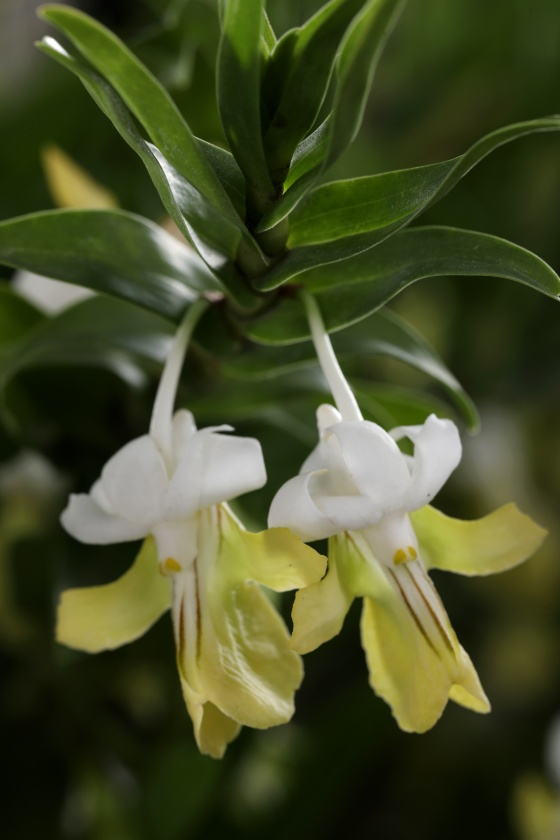

# OrchidColorAnalyzer

OrchidColorDetector is a project designed to detect the dominant colors of orchid petals using semantic segmentation and image processing techniques. 
Additionally, it allows users to use their own segmentation models to detect the dominant colors of any objects of interest.

    

        
    

    

        
    

    

        
    

    

        
    

    

        
    

    

        
    

